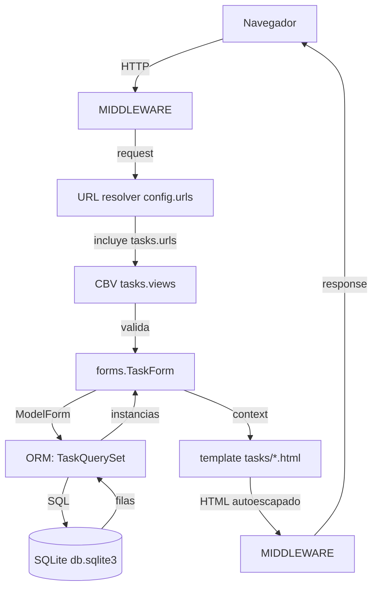
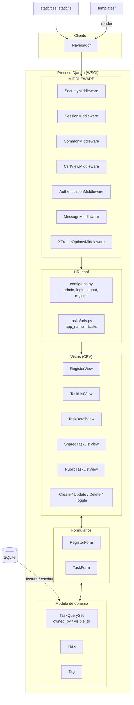
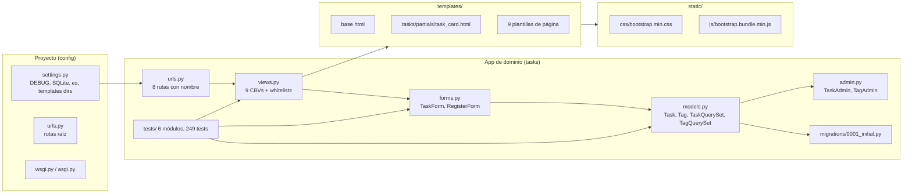
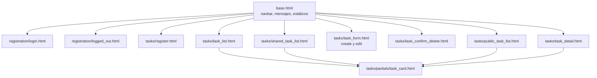
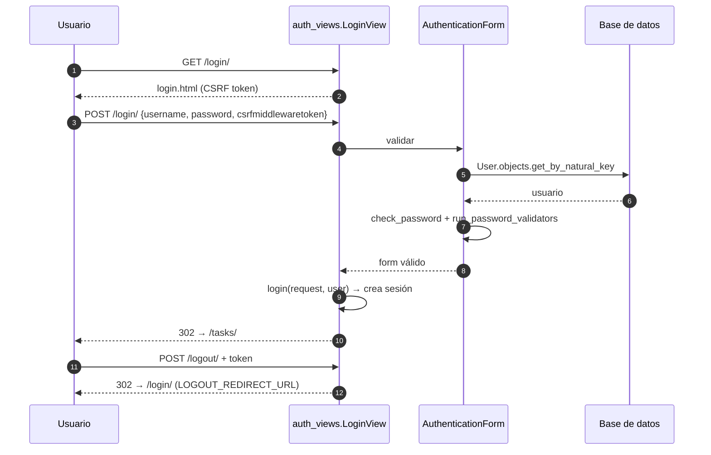

# Arquitectura — Task Manager

## 1. Por qué Django

El problema es un CRUD autenticado con autorización por propietario y dos niveles de
visibilidad de lectura. Es exactamente la forma de problema que Django resuelve de
izquierda a derecha:

- **ORM y migraciones.** `Task` y `Tag` se declaran como clases Python y
  `tasks/migrations/0001_initial.py` genera el esquema. No hay SQL escrito a mano.
- **Vistas genéricas como contrato.** `ListView`, `DetailView`, `CreateView`,
  `UpdateView` y `DeleteView` ya resuelven el ciclo pedido/validación/guardado/render.
  La consigna además las exige explícitamente.
- **Autenticación y CSRF.** `AuthenticationMiddleware` y `CsrfViewMiddleware` vienen en el
  esqueleto por defecto; no hay que construirlos ni auditarlos.
- **Admin.** `django.contrib.admin` entrega un panel de inspección útil con casi cero
  código, y la consigna lo pide en el corte de Semana 5.
- **Sistema de plantillas con autoescapado.** El XSS se cierra por omisión.

Lo que Django **no** trae y este proyecto tampoco necesita: una capa de API, un
framework de serialización, un ORM asíncrono, un admin builder o un sistema de permisos
objeto a objeto (los permisos se resuelven a mano porque el dominio tiene una sola regla:
"solo el dueño escribe" — ver ADR-008).

## 2. Por qué un monolito modular

La aplicación es un proceso WSGI, un módulo de Python y una base. La razón es de costo y
de dominio: no hay un segundo proceso que coordinar, no hay contrato de red que versionar
y no hay consistencia distribuida que justificar. Un despliegue es copiar el árbol,
aplicar migraciones y servir.

Un **microservicio** obligaría a decidir qué pasa con `User`: la FK `owner` es la bisagra
del dominio. Con servicios separados esa FK se vuelve una llamada remota o una
duplicación de datos, y el "es mi tarea" deja de ser un `WHERE` para ser una condición
de carrera. Para un monolito de dominio pequeño, la distribución no compra escalabilidad:
el cuello de botella real es la base de datos, y ahí los servicios no ayudan.

**CQRS** (separar modelo de escritura de modelo de lectura) implicaría duplicar el
esquema y mantener sincronía entre dos representaciones. La única consulta que no es
trivial es el listado con orden y filtro, y ya se resuelve con un índice compuesto y dos
listas de whitelist.

**Event Sourcing** (persistir hechos y reconstruir el estado) exige un log de eventos
como fuente de verdad, proyecciones y una capacidad de reconstrucción que la consigna no
evalúa. La tabla `Task` es la fuente de verdad, y además es legible por un humano en el
Django Admin, que es justamente lo que el corte de Semana 5 pide.

El coste honesto de esta decisión: un monolito no escala por separado ninguna capa. Si
algún día el perfil de carga lo justificara, habría que extraer el módulo `tasks` con su
propio esquema, y el momento natural para hacerlo es el día que una consulta concreta se
vuelva el cuello de botella, no hoy.

## 3. MVT: qué significa

Django implementa la variante **MVT (Model–Template–View)** de la arquitectura MTV, que es
la inversa de la descomposición clásica de una capa de presentación:

| Capa | Significado en Django | Dónde vive en este proyecto |
| --- | --- | --- |
| **Model** | La capa de datos: definición de entidades, campos, relaciones, validaciones a nivel de dominio y la interfaz con la base. Django la llama "la capa de datos" y la considera el corazón de la aplicación. | `tasks/models.py` |
| **Template** | La capa de presentación: HTML con autoescapado, sin lógica de negocio. Es un *lenguaje de plantillas*, no un motor de plantillas. | `templates/` |
| **View** | El lugar donde se conecta todo: recibe el `HttpRequest`, decide el código Python a ejecutar, elige la plantilla y devuelve un `HttpResponse`. | `tasks/views.py`, `tasks/forms.py` |

La diferencia con una arquitectura de capas clásica (`View → Service → Repository → Model`) es
intencional: Django no tiene capa de servicio ni repositorio. En proyectos más grandes se
añaden, pero aquí la lógica de negocio cabe en los métodos de `clean_*` del formulario, en
las políticas del `QuerySet` y en la sobrescritura puntual de `get_queryset()` /
`form_valid()`. Agregar una capa intermedia sería ceremonia sin un problema que
resolver.

## 4. Flujo de una petición

La cadena completa, de la entrada a la respuesta:



Tres capas de seguridad actúan en distintos puntos de esa cadena: el middleware CSRF
verifica el token antes de que la vista corra, la vista resuelve la autorización en el
queryset antes de tocar la fila, y el autoescapado de la plantilla actúa al renderizar.

## 5. Vista general de la arquitectura



## 6. Estructura de componentes



### Responsabilidad de cada archivo

| Archivo | Responsabilidad | No-responsabilidad |
| --- | --- | --- |
| `config/settings.py` | Configuración del proyecto, sin nada del dominio | No declara modelos ni vistas |
| `config/urls.py` | Rutas raíz: admin, login, logout, register, montaje de `tasks` | No declara rutas de detalle |
| `tasks/urls.py` | Las 8 rutas del dominio, todas con nombre bajo `app_name = "tasks"` | No contiene lógica de negocio |
| `tasks/models.py` | Entidades, restricciones y las dos políticas de acceso | No sabe nada de HTTP |
| `tasks/forms.py` | Validación de entrada y resolución de etiquetas | No toca la base por su cuenta |
| `tasks/views.py` | Orquestación HTTP: qué plantilla, con qué queryset, con qué mensajes | No redefine las reglas de acceso; las pide al queryset |
| `templates/base.html` | Cascarón: navbar, mensajes, carga de estáticos | Sin lógica de autorización |
| `static/` | Bootstrap 5.3.8 vendorizado (MIT), sin CDN | Sin assets propios |

## 7. Ciclo de vida de una petición: `TaskListView`

El caso más completo de la aplicación. Escribo paso a paso qué ocurre en
`GET /tasks/?status=pending&sort=priority&tag=django` con una sesión iniciada.

1. **El navegador emite el GET.** No hay cuerpo, no hay token CSRF que verificar:
   `CsrfViewMiddleware` solo rechaza peticiones no seguras cuando hay token.
2. **`SecurityMiddleware`** normaliza cabeceras y aplica `SecurityMiddleware` settings.
3. **`SessionMiddleware`** lee la cookie de sesión y la deja en `request.session`; más
   adelante `AuthenticationMiddleware` la convierte en un usuario.
4. **`CommonMiddleware`** procesa `APPEND_SLASH`. `/tasks` se redirige a `/tasks/`.
5. **`CsrfViewMiddleware`** verifica que no haya POST sin token válido. Pasa.
6. **`AuthenticationMiddleware`** resuelve `request.user` desde la sesión. Aquí es donde
   deja de ser `AnonymousUser` y pasa a ser el usuario dueño.
7. **`MessageMiddleware`** prepara el consumo de `django.contrib.messages`.
8. **`XFrameOptionsMiddleware`** agrega `X-Frame-Options` para impedir clickjacking.
9. **El resolver recorre `config/urls.py`.** `admin/`, `login/`, `logout/` y `register/`
   no coinciden; `path("tasks/", include("tasks.urls"))` sí, y el resto de la resolución
   ocurre dentro de `tasks/urls.py`, que resuelve `""` contra `views.TaskListView`.
10. **`as_view()` devuelve la respuesta de `dispatch()`.** `View.dispatch()` resuelve el
    método HTTP y, como `TaskListView` hereda de `LoginRequiredMixin`, el mixin actúa
    **antes** de `get()`: si `request.user` no está autenticado redirige a `LOGIN_URL` con
    un `?next=`. Ese mixin es la primera barrera de autorización y no depende de la
    plantilla.
11. **`get_queryset()` arma la consulta.** Parte de `Task.objects.owned_by(self.request.user)`,
    o sea `filter(owner=user)`: la política de escritura funciona como filtro del
    propietario. Luego aplica `prefetch_related("tags")`, lo que emite una segunda consulta
    para todas las etiquetas en vez de una por tarea.
12. **Se valida `?status=`.** `"pending"` está en `STATUS_FILTERS`, así que se resuelve a
    `False` y se aplica `filter(completed=False)`. Si el valor no estuviera en el diccionario
    se caería a `"all"` con `completed is None`, y no se filtraría. El input del usuario
    nunca es un booleano que llegue al ORM.
13. **Se valida `?tag=`.** `"django"` se pasa por `slugify()` y se aplica
    `filter(tags__slug=...)`. Un tag inexistente produce una lista vacía, no un error.
14. **Se valida `?sort=`.** `"priority"` está en `ALLOWED_SORTS`, así que el orden es
    `order_by("priority", "-pk")`. Un valor desconocido o malicioso cae a `"due_date"`.
    El string del usuario es una *clave de diccionario*, jamás un nombre de campo.
15. **`get()` de `MultipleObjectMixin` evalúa el queryset** y lo asigna a
    `self.object_list`; `context_object_name = "tasks"` hace que aparezca como `tasks` en
    el contexto.
16. **`get_context_data()` agrega estado de la interfaz:** `status`, `tag`, `sort`,
    `allowed_sorts` (para dibujar los botones de orden) y `all_tags`, que son las
    etiquetas usadas por este usuario en sus propias tareas, resueltas desde
    `Tag.objects.filter(tasks__owner=self.request.user)`. La plantilla puede así mostrar
    filtros coherentes con lo que el usuario tiene.
17. **Se renderiza `tasks/task_list.html`,** que extiende `base.html`. El partial
    `tasks/partials/task_card.html` se itera por tarea y dibuja badges de prioridad,
    estado, visibilidad y etiquetas.
18. **El autoescapado se aplica al renderizar.** `{{ task.title }}` escapa `<`, `>`, `&` y
    comillas, así que un título con `<script>` se muestra como texto.
19. **Los middlewares de salida procesan la respuesta** y el HTML vuelve al navegador con
    200.

Lo que **no** ocurre en ningún paso: ninguna consulta de autorización por separado,
ninguna comparación de `owner` escrita a mano en la vista y ninguna escritura.

## 8. Estructura de la aplicación

```
pwa-proyecto/
├── config/                  # proyecto Django
│   ├── settings.py
│   ├── urls.py
│   ├── wsgi.py
│   └── asgi.py
├── tasks/                   # app de dominio
│   ├── models.py
│   ├── views.py
│   ├── forms.py
│   ├── urls.py
│   ├── admin.py
│   ├── apps.py
│   ├── migrations/0001_initial.py
│   └── tests/               # 6 módulos, 249 tests
├── templates/
│   ├── base.html
│   ├── registration/        # login.html, logged_out.html
│   └── tasks/               # listados, detalle, form, confirmación
│       └── partials/task_card.html
├── static/
│   ├── css/bootstrap.min.css
│   └── js/bootstrap.bundle.min.js
├── docs/                    # esta documentación
├── pyproject.toml           # ruta de instalación con uv
├── uv.lock
├── requirements.txt         # ruta de instalación con pip + venv
└── manage.py
```

La separación proyecto/app es deliberada: `config` no debería contener jamás una regla de
negocio, y `tasks` no debería contener jamás una ruta raíz.

### Jerarquía de plantillas



`task_card.html` es el único lugar donde se dibujan las acciones de escritura, y está
protegido por ``. Esa es una ayuda de presentación: la autorización real
ya se resolvió en el paso 11 del ciclo de vida, antes de que existiera una sola fila en el
contexto.

## 9. Capa de autenticación

La autenticación no se reimplementa: se reutiliza `django.contrib.auth` completa.



Decisiones que sostienen esta capa:

- **`LoginView` y `LogoutView` son CBVs de Django.** `config/urls.py` las instancia
  explícitamente (`auth_views.LoginView.as_view(template_name="registration/login.html")`)
  en vez de incluirlas con `include()`, para que las vistas exigidas por la consigna sean
  legibles de un vistazo y para poder elegir la plantilla.
- **`LogoutView` es `POST`-only desde Django 5.** Un `GET /logout/` responde 405. Por eso la
  navbar renderiza un `<form method="post">` con `` y no un enlace: un
  `<a href="/logout/">` no funcionaría.
- **El registro no inicia sesión.** `RegisterView.form_valid()` llama a `super()` y luego
  redirige con `get_success_url()` a `reverse("login")`. La consigna deja el comportamiento
  abierto y no iniciar sesión mantiene el estado de sesión predecible.
- **Las credenciales se validan con el `AuthenticationForm` de Django**, que ya hace
  `check_password()` con el hasher por defecto (PBKDF2). Reimplementarlo "por consistencia" sería
  abstraer Django para la apariencia, que es justo lo que la consigna desaconseja.
  Justificación completa en ADR-004.
- **Los cuatro validadores de contraseña** de `AUTH_PASSWORD_VALIDATORS` se aplican tanto
  en el registro como en cualquier cambio de contraseña futuro. `RegisterForm` hereda de
  `UserCreationForm`, que ya los encadena.
