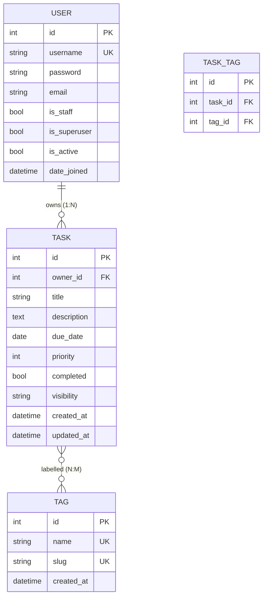

# Modelo de datos — Task Manager

Tres entidades: dos propias (`Task`, `Tag`) y una prestada del framework (`User`).
`User` **no** se redefine; `Task.owner` apunta a `settings.AUTH_USER_MODEL`, de modo que
cambiar el backend de autenticación no rompe el dominio.

## 1. Diagrama entidad-relación



`USER` y las claves foráneas de la tabla intermedia aparecen en el diagrama solo para mostrar
las relaciones; ninguna de esas entidades las define este proyecto.

## 2. Cardinalidades

| Relación | Cardinalidad | Explicación |
| --- | --- | --- |
| `User → Task` | **1:N** | `Task.owner = ForeignKey(settings.AUTH_USER_MODEL, related_name="tasks", on_delete=CASCADE)`. Un usuario tiene cero o muchas tareas; toda tarea tiene exactamente un propietario, y el campo es `NOT NULL` |
| `Task ↔ Tag` | **N:M** | `Task.tags = ManyToManyField(Tag, related_name="tasks", blank=True)`. Django materializa la relación en la tabla intermedia `tasks_task_tag`, con `task_id` y `tag_id` |
| `Task ↔ Task` | **Ninguna** | No hay jerarquía, ni padre, ni dependencias entre tareas. El modelo es plano a propósito |

`blank=True` en la M2M significa que una tarea sin etiquetas es un estado legítimo, no un
error de validación.

`related_name="tasks"` existe en **ambos** lados. Es lo que permite `user.tasks.all()`
para listar las tareas de un dueño y `tag.tasks.all()` para el admin. Sin
`related_name`, Django inventaría `task_set` y `tag_set`.

### `on_delete=CASCADE`

Si se borra un usuario, sus tareas se borran. Es la consecuencia lógica del agregado: una
tarea sin dueño no tiene propietario que pueda editarla, así que conservarla la dejaría
inaccesible de forma permanente. La tabla intermedia de la M2M también se limpia en cascada
por la base. La alternativa (`SET_NULL`) obligaría a permitir `owner = NULL` y por lo tanto
un tercer actor posible en la política de autorización, que no existe en el dominio.

## 3. Entidades

### 3.1 `Task`

| Campo | Tipo | Constraints | Origen | Notas |
| --- | --- | --- | --- | --- |
| `id` | `BigAutoField` | PK, autoincremental | Django | El `-pk` del orden por defecto desempata sobre esta columna |
| `owner` | `ForeignKey(AUTH_USER_MODEL)` | `NOT NULL`, `on_delete=CASCADE`, `related_name="tasks"` | Autor | Se asigna en la vista desde `request.user`, nunca desde el formulario |
| `title` | `CharField(200)` | `NOT NULL`, `blank=False` | Formulario | Es `NOT NULL` porque `blank=False` en el modelo y `required=True` en el `ModelForm` |
| `description` | `TextField()` | `NOT NULL` | Formulario | `TextField` sin longitud: en SQLite el límite real es el de la base |
| `due_date` | `DateField()` | `NOT NULL` | Formulario | `DateField` y no `DateTimeField`: la consigna pide una fecha de vencimiento, no un instante |
| `priority` | `IntegerField(choices=Priority.choices, default=MEDIUM)` | `NOT NULL`, default 2 | Formulario | Entero para que el orden de la base sea el orden semántico |
| `completed` | `BooleanField(default=False)` | `NOT NULL`, default `False` | Formulario o toggle | Booleano puro, sin `null=True` |
| `visibility` | `CharField(20, choices=Visibility.choices, default=PRIVATE)` | `NOT NULL`, default `"private"` | Formulario | `TextChoices`, valores legibles en la base |
| `tags` | `ManyToManyField(Tag, blank=True)` | Tabla intermedia | Formulario (`tags_input`) | No aparece en la migración de `Task` como columna: es tabla aparte |
| `created_at` | `DateTimeField(auto_now_add=True)` | `NOT NULL` | Automático | El usuario no puede alterarlo |
| `updated_at` | `DateTimeField(auto_now=True)` | `NOT NULL` | Automático | Se actualiza en cada `save()`; el toggle lo fuerza con `update_fields=["completed", "updated_at"]` |

### 3.2 `Tag`

| Campo | Tipo | Constraints | Origen | Notas |
| --- | --- | --- | --- | --- |
| `id` | `BigAutoField` | PK | Django | |
| `name` | `CharField(50, unique=True)` | `NOT NULL`, `UNIQUE` | Formulario | Es único **sensible a mayúsculas** a nivel de base. La insensibilidad es responsabilidad de la aplicación: `TagQuerySet.matching()` filtra con `name__iexact` |
| `slug` | `SlugField(50, unique=True)` | `NOT NULL`, `UNIQUE` | `Tag.save()` | `Tag.save()` deriva el slug con `slugify(self.name)[:50]` cuando viene vacío |
| `created_at` | `DateTimeField(auto_now_add=True)` | `NOT NULL` | Automático | No se usa en ninguna vista hoy; queda para auditoría |

La unicidad doble (`name` y `slug`) es lo que obliga a `TaskForm._resolve_tags` a buscar por
**las dos** columnas. Dos nombres distintos pueden slugificar al mismo valor — `"Python 3"`
y `"python-3"` producen ambos `python-3` — y en ese caso el slug resuelve el choque. Ver
ADR-006 y la sección de defectos en `docs/testing.md`.

### 3.3 `User`

No se define en este proyecto. Es `django.contrib.auth.models.User`, con su tabla
`auth_user`. Se usa únicamente como destino de `Task.owner` y como sujeto de la sesión que
resuelve `request.user`.

## 4. Elecciones de tipo

### 4.1 `priority`: entero, no cadena

`Priority` es un `IntegerChoices` con `LOW=1`, `MEDIUM=2`, `HIGH=3`.

Con entero, `ORDER BY priority` **ya** produce el orden semántico: baja, media, alta. Con
cadenas (`"low"`, `"medium"`, `"high"`) el orden sería alfabético, y con etiquetas en
español (`"baja"`, `"media"`, `"alta"`) también, lo que es directamente incorrecto.

La alternativa habría sido una tabla de lookup `Priority(id, name, rank)`, que resuelve
el orden pero agrega un `JOIN` a cada listado y un modelo más que mantener para tres
valores que no cambian. Con el entero, la restricción de dominio la garantiza
`IntegerChoices` en Python y `choices` en el formulario, sin tabla adicional.

El coste: los valores `1`, `2`, `3` en la base no son autodescriptivos para alguien que
abra el SQLite a mano. Se compensa con `Priority` documentada y con las etiquetas en
español en `choices`.

### 4.2 `visibility`: cadena, no entero

`Visibility` es un `TextChoices` con `PRIVATE="private"`, `AUTHENTICATED="authenticated"`,
`PUBLIC="public"`.

Aquí el orden **no importa**: la visibilidad no se ordena nunca. Lo que importa es leer la
base. `"public"` en una consulta manual o en un log es inmediatamente interpretable;
`"2"` no lo es. La comparación `filter(visibility=Visibility.PUBLIC)` genera
`WHERE visibility = 'public'`, que es legible en el log de SQL.

La coherencia entre `priority` (entero) y `visibility` (cadena) no es descuido: son dos
decisiones distintas sobre dos ejes distintos. `priority` optimiza el orden;
`visibility` optimiza la legibilidad.

### 4.3 `due_date`: `DateField`, no `DateTimeField`

Una tarea vence en un día, no en un instante. `DateField` ocupa 3 bytes frente a los
bytes de fecha-hora, evita la ambigüedad de zona horaria en la interfaz y ordena igual de
bien. Si el dominio exigiera "vence a las 18:00 del día", sería `DateTimeField`; no lo
exige.

## 5. Índices

`Task.Meta.indexes` declara dos índices explícitos, y Django crea además los índices
automáticos de la PK y de la FK `owner`.

| Índice | Campos | Consulta que sirve |
| --- | --- | --- |
| `tasks_task_owner_i_…` | `(owner, due_date)` | El listado del propietario: `WHERE owner = ? ORDER BY due_date` — filtro y orden en un solo índice |
| `tasks_task_visibil_…` | `(visibility)` | `PublicTaskListView` (`WHERE visibility = 'public'`) y la rama `visibility IN (...)` de `visible_to` para no propietarios |
| Automático de la FK | `(owner_id)` | Creado por `db_index=True` implícito en toda `ForeignKey`; cubre las búsquedas por propietario sin rango de fecha |
| `tasks_task_tag.task_id` / `.tag_id` | M2M | Django crea un índice por lado de la tabla intermedia; el filtro `?tag=` y `prefetch_related("tags")` los usan |

**Por qué `(owner, due_date)` y no dos índices separados.** El caso dominante es
`Task.objects.owned_by(user)` ordenado por `due_date` (`Task.Meta.ordering`). Con un índice
compuesto, la base resuelve el `WHERE` y puede devolver las filas ya en orden de
`due_date`, sin paso de ordenamiento. Con dos índices separados tendría que juntar las
filas por `owner` y después ordenar, es decir, un `filesort`.

**Por qué `(owner, due_date)` y no `(due_date, owner)`.** El orden de las columnas en un
índice compuesto sigue el orden de igualdad primero: `owner` está en el `WHERE` con
igualdad, `due_date` solo se ordena. La convención es poner la columna de igualdad primero.

**Por qué no un índice sobre `(owner, priority)`.** Existe el orden por prioridad
(`?sort=priority`), pero es el menos usado de los dos criterios y con `(owner, due_date)`
más el índice de `owner` la base resuelve la prioridad con un tamaño de conjunto que en
este dominio es pequeño. Agregar el cuarto índice costaría escrituras en cada cambio de
prioridad a cambio de una ganancia marginal. Es una decisión reversible: agregarlo es una
línea en `Meta.indexes` más una migración.

**Por qué no un índice sobre `completed`.** Es un booleano con una cardinalidad de dos
valores. Un índice sobre él casi nunca lo usa el planificador: PostgreSQL y SQLite
ignoran los índices de baja cardinalidad para filtrar, y el conjunto de "tareas
completadas de este usuario" es una fracción del conjunto que ya recupera
`(owner, due_date)`. Filtrar por `completed` sobre las filas del propietario es un filtro
de resistencia aplicado sobre datos ya presentes en memoria.

## 6. Nivel de normalización

El esquema está en **tercera forma normal (3FN)**, con dos desnormalizaciones controladas y
conscientes.

**Qué está normalizado:**

- Todas las claves primarias son surrogate (`id`), por lo que no hay dependencia
  transitiva entre atributos no clave.
- `owner_id` es una FK, no un nombre de usuario duplicado. No hay anomalía de actualización.
- `Tag` es una entidad independiente, no una lista de texto dentro de `Task`. No hay grupo
  repetido.
- La etiqueta y el slug están en su propia tabla, no replicados por tarea.

**Desnormalizaciones deliberadas:**

1. **`Tag.slug` es derivable de `Tag.name`**, es decir una dependencia funcional que la 3FN
   prohíbe. Se acepta porque el slug se usa como clave de consulta (`filter(tags__slug=...)`)
   y porque debe ser `UNIQUE` para resolver colisiones. El coste es que la base no garantiza
   que `slug` sea siempre el `slugify(name)`: alguien puede escribirlo a mano. La mitigación
   es `Tag.save()`, que lo deriva cuando viene vacío, más `TagAdmin.prepopulated_fields` que
   lo completa en la interfaz.
2. **`Task.updated_at` es derivable** en el sentido de que depende del historial, no del
   estado. Se guarda porque reconstruirlo exigiría un log de auditoría que el proyecto no
   tiene.

**Lo que no se normalizó y no debía:** no hay tabla de estados, no hay tabla de roles y no hay
entidad `Project`. `Visibility` y `Priority` viven como `choices` en el esquema, no como
tablas, por el argumento de la sección 4.1.

## 7. Orden por defecto y desempate

```python
class Meta:
    ordering = ["due_date", "priority", "-pk"]
```

Es el orden por defecto de **todo** queryset de `Task` que no lo sobreescriba, y por eso
no es una decisión de vista sino de modelo.

La lectura de izquierda a derecha es una cascada de criterios:

1. **`due_date` ascendente.** Lo más próximo vence primero. Es el criterio que un usuario de
   gestor de tareas espera por defecto.
2. **`priority` ascendente.** A igual fecha, la más urgente primero. Como `priority` es
   entero, "ascendente" es literalmente 1 → 2 → 3.
3. **`-pk` descendente.** El desempate.

**Por qué hace falta `-pk`.** Sin el tercer criterio, dos tareas con la misma fecha y la
misma prioridad quedan en un orden que la base no garantiza: SQLite puede devolverlas en
cualquier orden entre dos consultas idénticas. Eso es invisible en una página y muy visible
al paginar o al comparar dos recargas consecutive. Como `pk` es única y monotónica, `-pk`
produce un orden total y estable.

**Por qué `-pk` y no `pk`.** Con `-pk`, entre dos tareas empatadas gana la creada más
reciente, que es la que el usuario está mirando. Con `pk` ascendente ganaría la más antigua.
Ninguna de las dos es "correcta" en abstracto; la segunda es la menos sorprendente.

**Quién lo sobreescribe.** `TaskListView.get_queryset()` termina con
`order_by(*ALLOWED_SORTS[self.sort], *SORT_TIE_BREAKER)`, así que el orden por
`?sort=priority` es `priority, -pk` y el orden por `?sort=due_date` es `due_date, -pk` — el
`Meta.ordering` no aplica porque `order_by()` explícito lo reemplaza. `SharedTaskListView` y
`PublicTaskListView` usan `("-created_at", "-pk")`: ahí el criterio relevante es la
recencia de publicación, no la fecha de vencimiento, porque esas tareas ya no son del
usuario que las mira. El desempate `-pk` se mantiene en los tres casos.

## 8. Restricciones y su lugar de aplicación

| Restricción | Declarada en | Se violaría si |
| --- | --- | --- |
| `name` de etiqueta única | `unique=True` en el campo | Se inserta un duplicado exacto |
| `slug` de etiqueta único | `unique=True` en el campo | Se inserta un slug repetido, normalmente por colisión de `slugify` |
| Etiqueta de hasta 50 caracteres | `max_length=50` + `clean_tags_input` | El usuario escribe un nombre largo; el formulario lo rechaza antes de llegar a la base |
| Sin etiquetas duplicadas por mayúscula | `clean_tags_input` normaliza a minúsculas y deduplica | Se escribe `"Django, django, DJANGO"` en un mismo envío |
| `owner` no manipulable desde el formulario | El campo no está en `TaskForm.Meta.fields` | Un POST con `owner=otro_id` no lo contempla ni lo aplica |
| Un solo propietario por tarea | `ForeignKey` (no `ManyToManyField`) | — por construcción |
