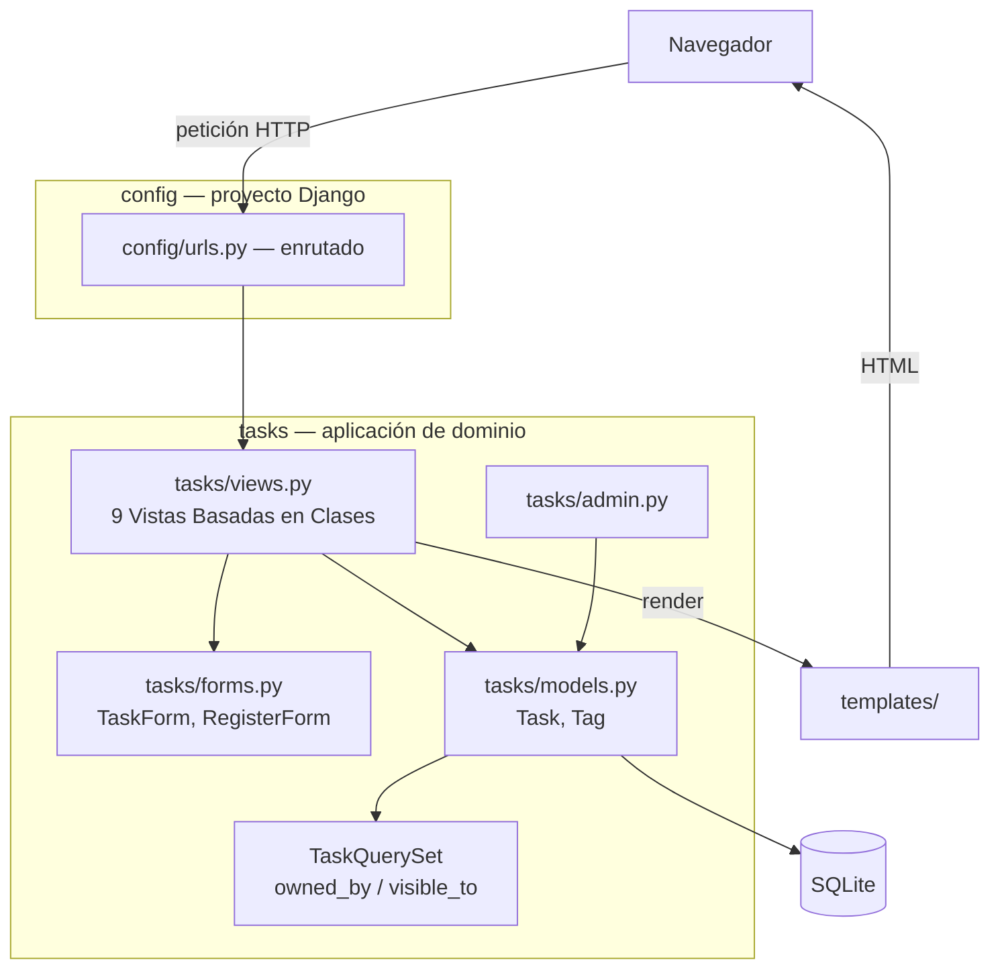
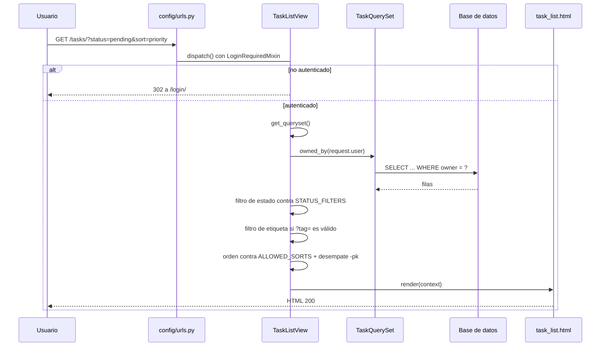
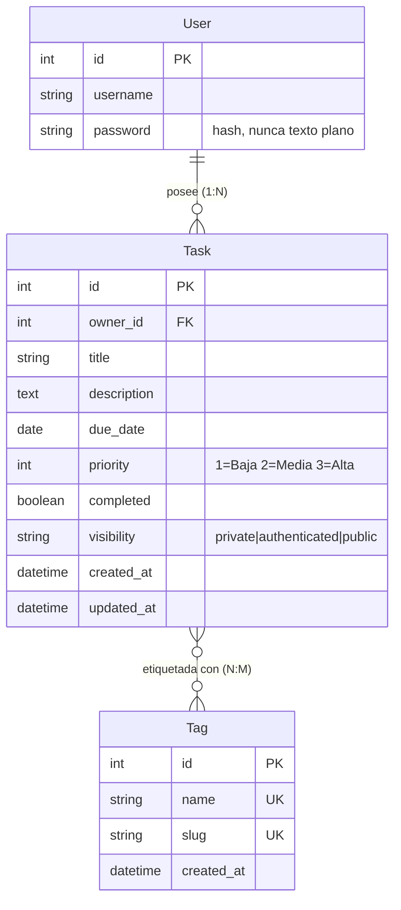

# Task Manager: una aplicación web de gestión de tareas con control de visibilidad y propiedad, construida sobre Django y Bootstrap 5

## Resumen

Este trabajo presenta el diseño y la implementación de una aplicación web de gestión
de tareas personales y profesionales, developed sobre Django 6.1.1 con Django
Templates, el ORM de Django y Bootstrap 5.3.8 como sistema visual, sobre SQLite como
base de datos de desarrollo.

El problema central no era la gestión de tareas en sí, sino el control de acceso a
ellas. Una aplicación de tareas típica permite que cada usuario gestione lo suyo, pero
la consigna académica exigía además un modelo de visibilidad de tres niveles —privada,
compartida con usuarios registrados y pública— sin que la visibilidad otorgara jamás
permisos de escritura. Este requirement es el queorganiza la arquitectura completa.

La decisión estructural del proyecto fue centralizar las dos políticas de autorización
—lectura y escritura— en el `QuerySet` del modelo `Task`, en lugar de distribuirlas
entre las vistas. Ninguna vista puede reinterpretar las reglas porque todas consultan el
mismo método, y una tarea ajena nunca llega a cargarse en memoria: responde 404 y no
403, de modo que el sistema tampoco confirma indirectamente que esa tarea existe.

El proyecto se entrega con 249 pruebas automatizadas, todas en verde, que cubren la
matriz completa de autorización actor por visibilidad, las listas blancas de
ordenamiento y filtrado frente a intentos de inyección, y siete pruebas de regresión
derivadas de defectos reales detectados durante el desarrollo. Se documentan ocho
decisiones arquitectónicas en sus registros correspondientes.

## Palabras clave

django, aplicación web, control de acceso, visibilidad, vistas basadas en clases, bootstrap 5, pruebas automatizadas, arquitectura mvt

## 1. Introducción

### 1.1 Contexto

La gestión de tareas es, probablemente, el caso de uso másinctamente repetido en los
proyectos de programación web de introductory. Almost todas las herramientas de gestión
de tareas que se usan a diario —un tablero de trabajo, una lista de pendientes, un
calendario de entregas— comparten una misma estructura conceptual: un conjunto de
elementos con un título, una descripción, una fecha y una importancia relativa, que
pertenece a alguien y que puede completarse.

Lo que distingue a una aplicación de gestión de tareas de un simple ejercicio de
formulario es la pregunta de **quién puede ver y quién puede tocar cada elemento**. En
un contexto individual, esa pregunta es trivial: todo es mío. En cuanto aparecen otros
usuarios, la pregunta deja de ser trivial, y las respuestas posibles se multiplican.
¿Puede un usuario ver la tarea de otro? ¿Puede verla pero no modificarla? ¿Puede un
visitante que ni siquiera tiene cuenta ver algo? ¿Qué debería pasar cuando alguien
intenta adivinar una dirección de una tarea que no le pertenece?

### 1.2 Problema

El trabajo parte de una consigna académica que especifica ocho requisitos funcionales y
dos restricciones duras. Los requisitos cubren la gestión de tareas, el diseño
responsive, la ordenación, el filtrado, las etiquetas, la autenticación, la propiedad de
los datos y la visibilidad. Las restricciones son dos: no puede utilizarse Django REST
Framework, y todas las vistas deben ser clases.

Entre los ocho requisitos, el séptimo es el que concentra la dificultad real:

> El usuario puede hacer visible sus tareas (solo lectura) a otros usuarios o de manera
> pública (usuario anónimo).

Este requisito introduce un modelo de acceso que no es el habitual. En la mayoría de
las aplicaciones, la visibilidad es un interruptor binario: privada o pública. Aquí la
consigna pide un modelo de tres niveles, y —esto es lo que suele pasarse por alto— pide
además que compartir una tarea no implique poder modificarla. Un usuario externo puede
leer una tarea compartida, pero no puede editarla, borrarla, completarla ni cambiarle
las etiquetas.

Las restricciones duras no son un obstáculo administrativo. La prohibición de Django
REST Framework elimina la tentación de construir una API y, con ella, la tentación de
duplicar la validación que el sistema de formularios ya resuelve. La exigencia de vistas
basadas en clases elimina la de resolver cada vista como mejor parezca y obliga
a un diseño de composición coherente.

### 1.3 Objetivos

**Objetivo general.** Construir una aplicación web de gestión de tareas que permita a
cada usuario administrar sus propias tareas y decidir su grado de exposición, sobre una
arquitectura que haga las reglas de acceso explícitas, verificables y demostrables.

**Objetivos específicos.**

1. Modelar el dominio de tareas y etiquetas con integridad referencial correcta.
2. Implementar un modelo de visibilidad de tres niveles en el que la visibilidad nunca
   otorgue permisos de escritura.
3. Centralizar la autorización en un único lugar del código, de modo que ninguna vista
   pueda implementar su propia interpretación de las reglas.
4. Proteger el sistema frente a la manipulación de identificadores y de parámetros de
   consulta, verificándolo con pruebas automatizadas y no con argumentos.
5. Entregar una interfaz responsive que funcione de manera aceptable desde un teléfono
   de 360 píxeles hasta una pantalla de escritorio.
6. Documentar las decisiones arquitectónicas, incluidas las alternativas descartadas y
   los costos asumidos.

### 1.4 Alcance

El alcance cubre el ciclo completo de vida de una tarea —creación, edición, borrado y
completado—, su consulta con ordenamiento y filtrado, su etiquetado, su exposición a
terceros y la administración por el sitio de administración de Django.

Quedan explícitamente fuera del alcance, por decisión propia y no por omisión: una API
programática, el envío de notificaciones por correo, la paginación de listados, el
borrado lógico, la restricción de fechas de vencimiento en el pasado, la
internacionalización de la interfaz y el modo oscuro. Estas omisiones se justifican
en la sección 12.

## 2. Requisitos del sistema

### 2.1 Requisitos funcionales

| ID | Requisito | Origen en la consigna |
| --- | --- | --- |
| RF-01 | Un visitante puede registrarse con nombre de usuario, contraseña y su confirmación. | Requisito 5 |
| RF-02 | Existen inicio de sesión y cierre de sesión. Las áreas privadas exigen autenticación. | Requisito 5, 6 |
| RF-03 | Un usuario autenticado crea tareas con título, descripción, fecha de vencimiento y prioridad. | Requisito 2 |
| RF-04 | El propietario edita exclusivamente sus propias tareas. | Requisito 2, 6 |
| RF-05 | El propietario elimina exclusivamente sus propias tareas. | Requisito 2, 6 |
| RF-06 | El propietario marca una tarea como completa o la devuelve a pendiente. | Requisito 2 |
| RF-07 | El propietario ve un listado de sus tareas con título, descripción resumida, fecha, prioridad, estado, etiquetas y visibilidad. | Requisito 2, 3 |
| RF-08 | El listado puede ordenarse por fecha de vencimiento o por prioridad. | Requisito 3 |
| RF-09 | El listado puede filtrarse por estado: todas, pendientes o completadas. | Requisito 3 |
| RF-10 | Una tarea admite cero, una o varias etiquetas; una etiqueta se reutiliza entre tareas. | Requisito 4 |
| RF-11 | El usuario localiza tareas por etiqueta. | Requisito 4 |
| RF-12 | Cada tarea tiene un nivel de visibilidad: privada, compartida o pública. | Requisito 7 |
| RF-13 | Un visitante anónimo puede ver una tarea pública, solo en lectura. | Requisito 7 |
| RF-14 | Un usuario autenticado que no es propietario puede ver una tarea compartida, solo en lectura. | Requisito 7 |

### 2.2 Requisitos no funcionales

La consigna no enumera una sección de requisitos no funcionales, pero se deducen de sus
exigencias de diseño responsive, buenas prácticas, validación y seguridad.

| ID | Requisito | Verificación |
| --- | --- | --- |
| RNF-01 | La aplicación es usable en móvil, tablet y escritorio. | Inspección a 360, 768 y 1440 px |
| RNF-02 | La navegación es clara y las acciones disponibles son discoveribles. | Inspección |
| RNF-03 | Los recursos privados no quedan expuestos. | 45 pruebas de permisos |
| RNF-04 | Los datos se validan en el servidor antes de persistirse. | 56 pruebas de formularios |
| RNF-05 | La arquitectura separa modelos, vistas, formularios, plantillas, estáticos y pruebas. | Estructura del repositorio |
| RNF-06 | Las reglas críticas son comprobables automáticamente. | 249 pruebas |
| RNF-07 | Bootstrap 5 provee un sistema visual coherente. | Inspección |
| RNF-08 | HTML semántico, etiquetas asociadas a los campos y contraste razonable. | Inspección |
| RNF-09 | Las contraseñas nunca se almacenan en texto plano. | Validadores de Django |
| RNF-10 | Cada requisito funcional se puede relating con su implementación y su prueba. | `docs/traceability.md` |
| RNF-11 | La arquitectura y las decisiones relevantes están documentadas. | `docs/`, 8 ADR |
| RNF-12 | No se introducen componentes ni dependencias innecesarias. | Auditoría de dependencias |

### 2.3 Restricciones

1. **No se permite Django REST Framework.** La aplicación es server-rendered; no existe
   capa de API.
2. **Todas las vistas deben ser Vistas Basadas en Clases.** No hay ni una sola vista
   basada en función.
3. **El trabajo se entrega en cuatro cortes**: prototipo estático con Bootstrap en la
   semana 3, proyecto configurado con modelos y administración en la semana 5,
   enrutamientos, vistas y autenticación en la semana 7, y entrega final con plantillas
   y formularios propios en la semana 9.
4. **Bootstrap 5** es obligatorio como base del diseño visual.

## 3. Análisis del problema

### 3.1 Actores

El sistema contempla cuatro actores, que se distinguen por su relación con una tarea
concreta más que por sus permisos globales.

**El visitante anónimo** es quien no ha iniciado sesión. No puede crear ni modificar
nada. Su única capacidad es leer tareas públicas. Es un actor de primera clase, no una
excepción: la consigna exige que el acceso público exista, y la aplicación debe ser
usable sin obligar a registrarse.

**El usuario autenticado** ha demonstrated su identidad pero no es necesariamente el
dueño de la tarea que está mirando. Este es el actor que suele olvidarse en el diseño,
y es la fuente habitual de las vulnerabilidades de referencia directa a objeto
inseguro. Puede crear sus propias tareas, gestionarlas, y leer las tareas que otros le
compartieron.

**El propietario** es el usuario autenticado respecto de una tarea propia. Solo él
puede modificarla. Ningún otro rol, por privileged que sea, cambia esta regla: el
administrador del sitio de administración de Django es un concepto distinto y separado.

**El no propietario** es la intersección de los dos anteriores: está autenticado y está
viendo la tarea de otro. Su capacidad es estrictamente de lectura. Este rol es el que
da sentido a la palabra "solo lectura" del requisito 7.

### 3.2 Ejemplo trabajado

Supongamos dos usuarios, Ana y Bruno, y tres tareas de Ana.

Ana tiene una tarea **privada** —el borrador de un informe—, una tarea **compartida** —
el plan de una reunión de equipo— y una tarea **pública** —una lista de lecturas
recomendadas—.

- Ana ve las tres, y sobre las tres puede leer, editar, completar, eliminar y cambiar su
  visibilidad.
- Bruno, que está autenticado, ve la compartida y la pública. Sobre ambas puede
  únicamente leer. Si escribe a mano la dirección de la tarea privada de Ana en la barra
  de direcciones, obtiene una respuesta 404: el sistema no le dice que la tarea existe ni
  que le está prohibiting el acceso; simplemente no encuentra nada.
- Un visitante anónimo ve únicamente la pública, y solo puede leerla.

Lo que este ejemplo revela es la propiedad estructural del diseño: **la visibilidad es
una propiedad de la lectura, nunca de la escritura**. El mismo usuario, en el mismo
instante, puede tener permiso de lectura y no tenerlo de escritura sobre el mismo objeto.
Esa asimetría es exactamente lo que el requisito 7 pide y lo que una única bandera
"público" no puede expresar.

### 3.3 Entidades

**Usuario.** No se define un modelo propio: se utiliza el modelo de usuario de
`django.contrib.auth`. La consigna no pide datos de perfil adicionales, y crear un modelo
propio obligaría a duplicar mechanisms de autenticación que Django ya resuelve y prueba.

**Tarea.** Es la entidad central. Se deservingreno exactamente un propietario y
tiene cuatro campos exigidos por la consigna —título, descripción, fecha de vencimiento
y prioridad— más los que el dominio necesita para funcionar: propietario, estado de
completado, nivel de visibilidad, etiquetas, y dos marcas temporales de creación y
actualización.

**Etiqueta.** Es una etiqueta de texto libre que puede compartirse entre muchas tareas.
No tiene propietario, porque una tarea compartida necesita mostrar sus etiquetas a quien
la lee, y una etiqueta con dueño impediría eso.

### 3.4 Autenticación y autorización como conceptos distintos

Conviene separar dos conceptos que a menudo se confunden.

La **autenticación** responde a "¿quién sos?". La **autorización** responde a
"¿qué podés hacer con esto?". Son independientes: un usuario puede estar perfectamente
autenticado y, aun así, no tener permiso sobre un recurso concreto.

La consigna exige autenticación en el punto 5 y control de propiedad en el punto 6, y
son problemas de naturaleza distinta. Confundirlos —por ejemplo, confiar en que "ya está
autenticado, entonces puede editar"— es exactamente el error que produce una
vulnerabilidad de referencia directa a objeto inseguro.

## 4. Arquitectura

### 4.1 Por qué Django

Django fue elegido por dos razones que conviene distinguir, porque a menudo se confunden.

La primera es normativa: la consigna exige explícitamente trabajar con Django. Cualquier
otra consideración es secundaria frente a este hecho.

La segunda es técnica, e independiente de la primera. Django resuelve de forma integrada
cinco problemas que este proyecto necesita: el mapeo objeto-relacional, la autenticación
con almacenamiento seguro de contraseñas, el sistema de formularios con validación, el
sitio de administración, y el renderizado en el servidor. Cruzar esos cinco problemas con
bibliotecas separadas habría producido una aplicación donde buena parte del esfuerzo
se dedicaría a hacer que las piezas se entendieran entre sí. La integración es lo que
permite que el núcleo del proyecto —la lógica de autorización— ocupe una proporción
razonable del código.

También es importante decir por qué Django **no** fue la elección natural para todo. La
combinación de la restricción contra Django REST Framework con el perfil server-rendered
de la aplicación es deliberada: sin capa de API, el sistema tiene una única forma de
entrada y, en consecuencia, un único lugar donde la autorización debe aplicarse.

### 4.2 Qué significa MVT/MTV

Django sigue un patrón derivado del modelo de vista-controlador, con una sustitución
del controlador por un enrutador con ciclo de vida gestionado. En la práctica:

- **Model**: la capa de datos. Describe qué es una tarea, qué campos tiene, qué
  relaciones la unen a otras entidades y qué reglas se garantizan a nivel de base de
  datos.
- **View**: la capa de lógica de petición. Recibe una petición, decide qué hacer, y
  entrega un contexto.
- **Template**: la capa de presentación. Describe cómo se ve, nunca qué está permitido.

La distinción relevante para este proyecto es que **template y view no comparten
responsabilidades sobre la seguridad**. Un template decide qué botones dibujar; una view
decide si la operación procede. La plantilla no es un mecanismo de control.

### 4.3 Monolito modular



El proyecto es un **monolito modular**: un único proceso y una única base de datos,
divididos internamente en módulos con responsabilidades delimitadas. La alternativa
—microservicios— fue descartada. Un microservicio resuelve problemas de escalado
independiente y de despliegue independiente, y este sistema no tiene ninguno de los dos:
su carga es la de una aplicación de aula, y su dominio es una sola operación coherente
—gestionar tareas— que no gana nada al partirse. La architectónicamente correcta para
este problema es un monolito.

También se descartaron CQRS y Event Sourcing, que introducen complejidad de
consistencia eventual y de versionado de eventos a cambio de beneficios de auditoría y
escalado que este proyecto no necesita. Y se descartó una aplicación de "arquitectura
limpia" con capas y puertos que, en un proyecto de este tamaño, habría separado el
código de la lógica real sin aportar Testabilidad adicional: la lógica ya es testeable
porque está concentrada y sin dependencias de infraestructura.

### 4.4 Ciclo de vida de una petición



El recorrido de `GET /tasks/?status=pending&sort=priority` es el siguiente:

1. **Enrutado.** `config/urls.py` incluye `tasks.urls` bajo el prefijo `/tasks/`, y el
   enrutador resuelve el patrón hacia `TaskListView`.
2. **Autenticación.** `LoginRequiredMixin` intercepta la petición antes de ejecutar
   nada. Si no hay sesión, redirige a la pantalla de inicio de sesión. La comprobación
   ocurre en este punto, no al final.
3. **Restricción de propiedad.** `get_queryset()` comienza siempre por
   `Task.objects.owned_by(self.request.user)`. Esta es la primera línea del método y no
   es opcional: garantiza que ninguna tarea ajena entre en la cadena de procesamiento.
4. **Filtrado por estado.** El valor de `?status=` se busca como clave en
   `STATUS_FILTERS`. Si no está en el diccionario, se sustituye por el valor por defecto.
   El valor crudo del usuario nunca se entrega al ORM.
5. **Filtrado por etiqueta.** Si `?tag=` está presente, se convierte a slug y se filtra
   por `tags__slug`.
6. **Ordenamiento.** El valor de `?sort=` se busca como clave en `ALLOWED_SORTS`, que
   devuelve una lista de campos del ORM, no un nombre de campo tomado del input. A todo
   ordenamiento se le añade `-pk` como criterio secundario.
7. **Renderizado.** El contexto incluye las tareas y los tres parámetros activos, para
   que la plantilla pueda mostrar qué filtros están aplicados.

El orden de los pasos importa. La restricción de propiedad es la primera porque es la
única que no admite excepción; el ordenamiento es el último porque opera sobre un
conjunto ya acotado.

## 5. Diseño del dominio

### 5.1 Modelo de datos



### 5.2 Cardinalidades y propiedad

La relación entre usuario y tarea es de uno a muchos: un usuario puede tener muchas
tareas, y una tarea pertenece **exactamente** a un usuario. Esa Cardinalidad no es
decorativa; es la que hace que la propiedad sea una propiedad y no un atributo opcional.
No existe el caso "tarea sin dueño", porque el campo es obligatorio y la base de datos lo
garantiza.

La relación entre tarea y etiqueta es de muchos a muchos: una tarea puede tener varias
etiquetas, y una etiqueta puede estar asociada a muchas tareas. Se implementa con el
campo `ManyToManyField`, que Django materializa como una tabla intermedia.

### 5.3 Elección de tipos

**Prioridad: entero.** La prioridad tiene tres niveles con un orden semántico
—baja, media, alta— y ese orden debe coincidir con el orden de la base de datos. Al
almacenarla como entero, `ORDER BY priority` ya devuelve el orden correcto, sin tabla
auxiliar de equivalencias y sin función de ordenación en Python. Si se almacenara como
cadena, el orden alfabético de las etiquetas no coincidiría con el orden semántico y
habría que corregirlo en cada consulta.

**Visibilidad: cadena.** La visibilidad no tiene orden, tiene identidad semántica. El
valor `"private"` es más legible en una consola de administración de base de datos, en
un registro de errores y en una URL de depuración que el valor `1`. Además, permite
añadir un nuevo nivel sin migrar los datos existentes, siempre que la longitud del campo
lo admita.

### 5.4 Índices

Se definieron dos índices compuestos:

- **`(owner, due_date)`** porque la consulta dominante del sistema es "mis tareas
  ordenadas por vencimiento", que filtra por propietario y ordena por fecha. Un índice
  compuesto cubre el filtro y evita el ordenamiento en memoria.
- **`(visibility)`** porque las lecturas públicas filtran por ese campo sobre el
  conjunto completo, sin restricción de propietario.

Añadir índices es un compromiso: aceleran las lecturas y ralentizan las escrituras, y
ocupan espacio. Se añadieron únicamente los que corresponden a las dos consultas que el
sistema ejecuta de verdad, no índices preventivos.

### 5.5 Ordenamiento determinista

El ordenamiento por fecha de vencimiento tiene una ambigüedad natural: dos tareas pueden
compartir la misma fecha. Si el ordenamiento quedara indefinido, el resultado de la misma
consulta podría cambiar entre peticiones, lo que se manifiesta como tareas que "saltan"
de posición al recargar.

La solución es añadir un criterio secundario. En este proyecto, el orden por defecto es
`["due_date", "priority", "-pk"]` y todo ordenamiento solicitado por el usuario se le
concatena `-pk`. Como la clave primaria es única, la combinación de fecha, prioridad y
clave primaria no puede tener empates, y el resultado es estable.

Este detalle parece menor y no lo es: sin él, cualquier prueba de ordenamiento que
comparara listas completas sería intermitente, y la propia interfaz mostraría un
comportamiento que nadie podría reproducir.

### 5.6 Las políticas como invariantes del dominio

Las dos reglas de acceso del sistema están expresadas como métodos del `QuerySet` del
modelo, no como condiciones dispersas en las vistas:

- **`owned_by(user)`** — política de escritura. Devuelve únicamente las tareas cuyo
  propietario es el usuario dado.
- **`visible_to(user)`** — política de lectura. Devuelve las tareas que el usuario puede
  abrir: para un anónimo, solo las públicas; para un autenticado que no es propietario,
  las compartidas y las públicas; para el propietario, todas las suyas.

La razón de que vivan aquí, y no en las vistas, es que una vista no puede entonces
implementar su propia idea de quién puede ver qué. Si las reglas estuvieran escritas en
cada vista, cada vista nueva sería una nueva oportunidad de equivocarse, y nadie podría
auditar la corrección del sistema leyéndolas todas.

## 6. Seguridad

La seguridad es un requisito de primer nivel de la consigna, y en este proyecto se
concentra en un problema: **impedir que un usuario alcance un recurso que no le
pertenece**.

### 6.1 Referencia directa a objeto inseguro

El ataque más relevante contra una aplicación de este tipo se conoce como *Insecure
Direct Object Reference*, o IDOR. Consiste en Replace un parámetro de la URL.

La aplicación expone rutas como `/tasks/14/edit/`. El número `14` es un identificador
consecutivo, y un atacante que adivine o enumere números puede intentar abrir rutas
ajenas. El nombre completo de esta vulnerabilidad es engañoso: la referencia no es
directa en un sentido estricto; lo relevante es que el servidor confía en un
identificador que el cliente controla y no comprueba a quién pertenece.

La defensa se aplica en dos niveles.

**En el queryset.** Las vistas mutables no preguntan "¿cuál es la tarea con este
identificador?", sino "¿cuál es la tarea con este identificificador **y este
propietario**?":

```python
def get_queryset(self):
    return Task.objects.owned_by(self.request.user)
```

Como la restricción forma parte de la consulta, una tarea ajena simplemente no aparece
en el conjunto de resultados. La vista no llega a construir el objeto, y por lo tanto no
llega a procesarlo.

**En la vista.** Las vistas que usan `get_object_or_404` con un queryset ya restringido
heredan la misma protección sin trabajo adicional. La clase `TaskCompleteToggleView`, que
alterna el estado de completitud, lo hace explícito:

```python
task = get_object_or_404(Task.objects.owned_by(request.user), pk=pk)
```

### 6.2 Por qué 404 y no 403

Cuando un usuario solicita un recurso que existe pero sobre el que no tiene permiso, hay
dos respuestas razonables: `403 Forbidden`, que significa "existe pero no te lo
permitimos", y `404 Not Found`, que significa "no hay nada aquí".

Este sistema devuelve **404 deliberadamente**, y la razón es la fuga de información.
Con un 403, un atacante que recorre identificadores obtiene una señal valiosísima: sabe
que la tarea 14 existe aunque no pueda leerla. La densidad y el rango de tareas de cada
usuario se convierten en información observable. Con un 404, el atacante no puede
distinguir entre un identificador que no existe y uno que existe pero no le pertenece, y
el sistema no confirma nada.

El costo de esta decisión es que se pierde una distinción útil para depurar: un
desarrollador que pruebe una URL incorrecta verá un 404 idéntico al de un problema de
permisos. Es un costo aceptable, y está registrado como tal en el registro de decisión
correspondiente.

### 6.3 Separación entre lectura y escritura

El sistema no asocia "visible" con "editable". Son dos ejes independientes, y el modelo
los separa de forma explícita: `visible_to()` gobierna la lectura, `owned_by()` gobierna
la escritura, y ninguna ruta de escritura consulta `visible_to()`.

Una consecuencia práctica: una tarea pública sigue siendo editable **solo** por su
propietario. Que un desconocido pueda verla no le acerca un milímetro a poder modificarla.

### 6.4 Protección CSRF y métodos POST

La protección contra falsificación de peticiones entre sitios es una de las
características de seguridad incorporadas de Django, y su activación es automática
porque el middleware correspondiente forma parte de la pila por defecto.

Lo relevante en este proyecto es una consecuencia de la evolución del framework. Desde
Django 5, el cierre de sesión solo responde a peticiones `POST`; el cierre por `GET` fue
eliminado. Esto no es un detalle menor: un cierre de sesión por `GET` permitiría que
cualquier sitio incluyera una imagen con esa dirección y cerrara la sesión del usuario
que visitara la página.

Por la misma razón, alternar el estado de completitud de una tarea es una operación
`POST` y no un enlace. Un enlace puede ser recuperado por un rastreador, generado por un
marcador de página, o disparar un formulario `GET` implícito, como ocurre con
algunos buscadores internos. La clase declara `http_method_names = ["post"]` de
modo que cualquier otro verbo recibe `405 Method Not Allowed`.

La propia prueba de la matriz de autorización incluye una aserción explícita de que un
`GET` al conmutador devuelve 405, y de que un `GET` al cierre de sesión también.

### 6.5 Inyección a través de parámetros de consulta

El ordenamiento y el filtrado reciben su criterio del usuario, a través de la cadena de
consulta. Entregar ese valor directamente al ORM sería un error: el nombre de un campo
no es solo un dato, es una instrucción.

La defensa es una lista blanca. `ALLOWED_SORTS` es un diccionario cuyas claves son
literales aceptados y cuyos valores son las listas de campos que se entregan al ORM. El
input del usuario se usa **como clave de búsqueda**, nunca como valor:

```python
ALLOWED_SORTS = {
    "due_date": ["due_date"],
    "priority": ["priority"],
}
```

Si la clave no está en el diccionario, el ordenamiento cae al valor por defecto. No se
produce un error ni una consulta alternativa: simplemente no se reconoce el criterio. El
mismo mecanismo protege el filtrado por estado.

Comprobado durante la verificación: `?sort=owner; DROP TABLE tasks--`,
`?sort=' or 1=1--` y `?status=INJECTED` devuelven la página con el valor por defecto y no
producen ningún error. La base de datos permanece intacta.

### 6.6 Validación en el servidor

El HTML5 ofrece validación en el navegador que mejora la experiencia de uso, pero es
una comodidad, no un control. El usuario puede desactivar el JavaScript, usar un cliente
HTTP directo o manipular la petición. Toda la validación crítica ocurre en el servidor, en
el formulario y en los validadores de contraseña de Django.

Las contraseñas nunca se almacenan en texto plano: Django aplica una función de
derivación con sal, y además valida la robustez mediante cuatro validadores —longitud
mínima, similitud con otros atributos de la cuenta, contraseña común y ausencia de
componente puramente numérico—.

### 6.7 Escape automático de plantillas

Django escapa por defecto el contenido interpolado en las plantillas. Esto neutraliza la
inyección de HTML y de JavaScript en los datos que el usuario almacena, incluidos los
títulos de tareas y los nombres de etiqueta. La comodidad de escribir
`{{ task.title }}` en lugar de una llamada a una función de escape es, en realidad, una
decisión de seguridad.

### 6.8 Limitaciones de seguridad

Con honestidad, el proyecto no está endurecido para producción:

- `DEBUG = True` expone detalles internos ante un error. En producción debe ser
  `False` con un gestor de registros estático.
- `ALLOWED_HOSTS` está vacío, lo que es cómodo en desarrollo y peligroso en producción.
- No hay limitación de intentos de inicio de sesión, por lo que el sistema admite fuerza
  bruta. Django no lo incluye y no se añadió porque la consigna no lo exige.
- No hay configuración de HTTPS, cookies seguras ni endurecimiento de sesión más allá de
  los valores por defecto.
- SQLite no es un motor adecuado para producción con concurrencia.

Ninguno de estos puntos incumple la consigna; todos están documentados en
`docs/security.md`.

## 7. Diseño de interfaz

### 7.1 Bootstrap 5 como sistema visual

Bootstrap 5 fue impuesto por la consigna, y la elección técnica consistente fue
**vendorizar sus archivos** en lugar de referenciar una red de distribución de contenido.
La aplicación renderiza completa sin conexión a internet, no realiza peticiones a
terceros en tiempo de carga y se comporta igual por los dos caminos de instalación. El
costo es que los archivos deben actualizarse manualmente cuando sale una versión nueva.

La decisión de aplicar las clases de Bootstrap a los campos de formulario merece una
explicación, porque tiene una restricción real: Django no expone forma de modificar los
atributos de un widget desde una plantilla. La solución idiomática sería añadir
`django-widget-tweaks`, que es justamente la clase de dependencia que este proyecto
decidió evitar. Las clases se aplican entonces en el `__init__` del formulario, con una
comprobación del tipo de widget para elegir entre la clase de selector, la de casilla o
la de campo de texto.

### 7.2 Responsive: tabla en escritorio, tarjetas en móvil

La decisión de diseño más discutible del proyecto fue cómo representar el listado de
tareas, que muestra siete datos por elemento.

Una tabla de siete columnas en un teléfono de 360 píxeles obliga a desplazamiento
horizontal, que es la peor experiencia posible en la pantalla más pequeña y la que más
usuarios encuentran. La alternativa descartada fue reducir el número de columnas en móvil,
que obliga al usuario a discover qué dato se ocultó.

La solución adoptada muestra **ambos formatos a la vez, uno visible a la vez**: una
tabla con las clases que la ocultan por debajo de 768 píxeles, y una grilla de tarjetas
que la oculta por encima. En un teléfono se ven tarjetas apiladas, con toda la
información disponible y sin desplazamiento lateral; en un escritorio se ve la tabla,
que comparte mejor las columnas y resulta más eficiente para comparar tareas.

### 7.3 Jerarquía visual y estados

El color codifica el dominio, no decora:

- **Prioridad**: gris para baja, ámbar para media, rojo para alta.
- **Estado**: las tareas completadas se muestran tachadas y atenuadas, para que el
  listado se pueda leer de un vistazo.
- **Vencimiento**: una tarea pendiente cuya fecha ya pasó muestra una alerta roja
  distinta de las demás, que es la información accionable del listado.
- **Visibilidad**: cada tarea muestra su nivel con una etiqueta textual, para que el
  propietario no olvide que está compartiendo algo.

Se cubren todos los estados de interfaz que la consigna requiere: listado vacío, listado
con contenido, listado filtrado sin resultados, formulario nuevo, formulario de
edición, formulario con errores, confirmación de borrado, vista de solo lectura para
quien no es propietario y pantalla de sesión cerrada.

### 7.4 Accesibilidad

Se usa HTML semántico —`nav`, `main`, tablas con encabezado—, cada campo tiene su
etiqueta asociada, los errores se comunican con texto y no únicamente con color, y las
acciones destructivas piden confirmación. La navegación por teclado y el contraste
razonable provienen de Bootstrap.

### 7.5 Mensajes y realimentación

Tras cada operación —crear, editar, completar, eliminar, registrarse— la aplicación
muestra un mensaje de resultado. Los mensajes de éxito y error tienen estilos distintos,
de modo que el usuario sabe si la operación ocurrió.

## 8. Implementación

### 8.1 Modelos

El modelo `Task` declara el propietario como clave foránea al modelo de usuario de
Django, con eliminación en cascada: si un usuario se elimina, sus tareas se eliminan
también. Los cuatro campos exigidos por la consigna —título, descripción, fecha de
vencimiento y prioridad— son obligatorios. El campo de fecha es de tipo fecha sin hora,
porque una tarea "vence" en un día, no en un instante.

El modelo `Tag` lleva un nombre único y un *slug* único derivado automáticamente. El
nombre único impide que existan dos etiquetas que se diferencien solo por mayúsculas,
cosa que sería confusa para el usuario. El slug se usa internamente para el filtrado por
etiqueta, de modo que las direcciones no dependen de caracteres problemáticos.

Las dos políticas de autorización se implementan como métodos de un `QuerySet`
personalizado, que es la pieza estructural más importante del proyecto:

```python
class TaskQuerySet(models.QuerySet):
    def owned_by(self, user):
        return self.filter(owner=user)

    def visible_to(self, user):
        if not user.is_authenticated:
            return self.filter(visibility=Visibility.PUBLIC)
        return self.filter(
            Q(owner=user)
            | Q(visibility__in=[Visibility.AUTHENTICATED, Visibility.PUBLIC])
        )
```

### 8.2 Formularios

El formulario de tarea es un `ModelForm` sobre los campos del modelo, con una
excepción: las etiquetas se editan en un único campo de texto con nombres separados por
comas, en lugar de un selector múltiple.

La razón es de usabilidad. La consigna pide que las etiquetas se asignen y que se
puedan buscar, y un usuario real necesita dos cosas a la vez: reutilizar una etiqueta
que ya existe e inventar una nueva. Un selector múltiple obliga a dos gestos y dos
interfaces distintas; un campo de texto permite ambas cosas en uno, escribiendo
`universidad, trabajo`. La resolución a objetos `Tag` ocurre al guardar, porque un
`ModelForm` no puede persistir una relación muchos a muchos a partir de un campo de
texto corriente.

La limpieza de ese campo normaliza la entrada: recorta espacios, descarta segmentos
vacíos, pasa todo a minúsculas para que la reutilización sea insensible a mayúsculas,
elimina duplicados dentro de la misma entrada y rechaza nombres que excedan el límite
del modelo. La resolución busca primero por nombre —sin distinguir mayúsculas— y, si no
lo encuentra, por *slug*.

Esa segunda búsqueda no es un detalle defendativo sino una corrección necesaria. Al
desarrollar el proyecto se descubrió que dos nombres distintos que producen el mismo
*slug* —"Python 3" y "python-3"— colisionaban contra la restricción de unicidad y
producían un error de integridad que convertía el formulario en una respuesta de error
interna. La búsqueda por *slug* evita la colisión reutilizando la etiqueta existente.

El formulario de registro hereda de `UserCreationForm`, que aporta la comprobación de
coincidencia de contraseñas y los cuatro validadores de robustez.

### 8.3 Vistas

Las nueve vistas son clases. La más relevante para el diseño del sistema es el listado,
porque concentra las cuatro responsabilidades que la consigna pide separar:

```python
def get_queryset(self):
    queryset = Task.objects.owned_by(self.request.user).prefetch_related("tags")
    # ... filtro de estado, de etiqueta y ordenamiento
    return queryset.order_by(*ALLOWED_SORTS[self.sort], *SORT_TIE_BREAKER)
```

La primera línea no es negociable: es la que impide que una tarea ajena entre en el
proceso. El resto sonTransformaciones sobre un conjunto ya acotado.

Las vistas de detalle resuelven el objeto a través de un queryset restringido por la
política de lectura, y devuelven además una variable `is_owner` que la plantilla usa
para ocultar las acciones que el visitante no puede ejercer. Esa variable es una ayuda
de presentación, no un control: si la plantilla la ignorara por completo, el sistema
seguiría siendo seguro.

La alternancia del estado de completitud es una vista de clase que declara
`http_method_names = ["post"]`. Negarse a implementar un manejador para otros verbos hace
que Django responda automáticamente `405 Method Not Allowed`.

### 8.4 Plantillas

Todas las plantillas extienden una base que define la estructura, la barra de
navegación y la zona de mensajes. El panel de la aplicación incluye la barra de
navegación, el área de mensajes y el contenedor principal. No hay ni una repetición de
la barra de navegación entre plantillas.

Las operaciones que modifican datos se expresan siempre con formularios y token de
verificación, nunca con enlaces: la alternancia de completitud, el borrado y el cierre
de sesión. Los enlaces se reservan para las operaciones de lectura.

### 8.5 Administración de Django

Ambos modelos están registrados y configurados para ser útiles más que meramente
accesibles. La administración de tareas muestra en el listado el título, el propietario,
la fecha, la prioridad, el estado, la visibilidad y las etiquetas; permite filtrar por
estado, visibilidad, prioridad y fecha; busca por título, descripción y nombre de
usuario; y usa una jerarquía de fechas para navegar por vencimientos. La administración
de etiquetas muestra el número de tareas asociadas, y su campo de búsqueda es el que
alimenta el autocompletado del selector de etiquetas.

Esta configuración cumple el objetivo de la semana 5, que pedía modelos registrados en
el sitio de administración, y además convierte a la administración en una herramienta
de inspección real durante el desarrollo.

## 9. Pruebas

### 9.1 Estrategia

La estrategia de pruebas se ajustó al riesgo. El sistema tiene dos clases de
comportamiento muy distintas: la lógica de autorización, donde un error tiene
consecuencias de seguridad, y la lógica de presentación, donde un error tiene
consecuencias estéticas. Las pruebas se concentran donde el riesgo está.

Se utilizan únicamente las herramientas nativas de Django: sin *pytest*, sin
*factory_boy*, sin más dependencias. La consigna no justifica añadir dependencias de
pruebas, y el gestor de pruebas integrado descubre y ejecuta automáticamente todo lo
escrito bajo el paquete de pruebas de la aplicación.

La suite contiene **249 pruebas**, todas en verde.

| Archivo | Pruebas | Responsabilidad |
| --- | --- | --- |
| `test_models.py` | 33 | Valores por defecto, orden del metamodelo, *slug* de etiqueta, relación muchos a muchos, cascada |
| `test_forms.py` | 56 | Campos obligatorios, tipos enumerados, limpieza y resolución de etiquetas |
| `test_views.py` | 53 | Ciclo completo de creación, consulta, edición, borrado y completado |
| `test_permissions.py` | 45 | Matriz de autorización, defensa contra IDOR, políticas de conjunto |
| `test_filters.py` | 34 | Listas blancas, orden determinista, intentos de inyección |
| `test_regressions.py` | 28 | Un archivo por defecto corregido |

### 9.2 La matriz de autorización

La prueba más importante del proyecto es la que verifica la matriz de acceso exigida por
la consigna. Cada celda tiene al menos una aserción:

| Actor | Tarea privada | Tarea compartida | Tarea pública |
| --- | --- | --- | --- |
| Anónimo | 404 | 404 | 200, solo lectura |
| Registrado no propietario | 404 | 200, solo lectura | 200, solo lectura |
| Propietario | Acceso completo | Acceso completo | Acceso completo |

Las pruebas no se limitan a comprobar el código de respuesta del detalle. Verifican
también las operaciones de escritura sobre tareas ajenas —edición, borrado y
alternancia de completitud— y afirman de manera explícita que la respuesta es **404 y no
403**, porque esa distinción es una decisión deliberada del diseño y no un accidente.

### 9.3 Pruebas de las listas blancas

Las pruebas de filtrado y ordenamiento incluyen entradas maliciosas como
`?sort=owner; DROP TABLE tasks--`, `?sort=' or 1=1--` y `?status=INJECTED`. En todos los
casos la prueba afirma que la página se responde con normalidad, que el criterio cae al
valor por defecto y que el conjunto de tareas resultante es el esperado. Una prueba de
este tipo no verifica solo que no haya excepción: verifica que el sistema **se comporta
como si la entrada no existiera**.

### 9.4 Pruebas de regresión

Siete defectos se descubrieron durante el desarrollo, y cada uno tiene hoy un archivo de
pruebas dedicado. La consigna lo exige, y la razón es que la corrección de un defecto
sin una prueba que lo cubra es una corrección que se pierde en el siguiente refactor.

| Defecto | Síntoma que producía |
| --- | --- |
| `is_editable_by` declarado como propiedad que recibía un argumento | Error de tipo en toda página de detalle |
| `all_tags` consultando el conjunto equivocado por un campo inexistente | Error de campo en el listado principal |
| Ruta de registro ausente | Error de resolución de URL en toda página anónima |
| Vista de edición sin nombre de objeto contextual | El formulario de edición se anunciaba como «nueva tarea» |
| Controles de formulario sin clases de estilo | Formularios sin apariencia |
| Colisión de *slug* en etiquetas | Error de integridad al guardar |
| Enrutamiento montado en la raíz y no bajo el prefijo | Las rutas de la consigna no existían |

Los dos primeros merecen una reflexión, porque son errores de diseño y no de sintaxis.
El primero declaraba una propiedad que recibía un argumento, lo cual es imposible: al
acceder a una propiedad, el lenguaje llama a la función con la única instancia
disponible, y la función requería además el usuario. El error no apareció en ninguna
comprobación estática; se manifestó al ejecutar la página. El segundo consultaba un
conjunto de tareas donde debía consultar uno de etiquetas, y lo solicitaba ordenado por
un campo que las tareas no tienen. Ambos son el tipo de fallo que un análisis estático
podría haber detectado y que sólo aparece al ejecutar el código con datos reales.

### 9.5 Qué no se prueba, y por qué

La honestidad sobre los límites de la propia verificación es parte de un trabajo
académico.

**No hay pruebas de carga ni de concurrencia.** El sistema está diseñado para el volumen
de un curso; medir su comportamiento bajo miles de usuarios concurrentes carecería de
sentido y exigiría herramientas que la consigna no justifica.

**No hay pruebas extremo a extremo en navegador.** La suite opera con el cliente de
pruebas de Django, que ejercita las vistas, los formularios y las consultas reales, pero
no renderiza CSS ni ejecuta JavaScript. La consecuencia honesta es que la apariencia
responsive se verificó por inspección manual a tres anchos, no de forma automatizada.

**No hay pruebas de concurrencia sobre la alternancia de completitud.** Si dos peticiones
simultáneas alternaran la misma tarea, el resultado sería el esperado en cualquier caso,
pero no se ha comprobado que el sistema lo maneje de forma explícita.

## 10. Decisiones arquitectónicas

Esta sección presenta las ocho decisiones registradas. Cada una se expone con el mismo
esquema: el problema, las alternativas consideradas, la decisión, la razón, el
compromiso asumido y las consecuencias. La documentación completa de cada decisión, con
el detalle de las alternativas descartadas, se encuentra en los registros de decisión
arquitectónica del repositorio.

### 10.1 Arquitectura monolito modular sobre Django

**Problema.** La consigna exige Django y prohíbe una capa de API. La decisión abierta era
cómo organizar la aplicación.

**Alternativas.** (a) Monolito modular, que es la que ofrece el propio Django. (b)
Microservicios, separando gestión de tareas, autenticación y búsqueda. (c)
Arquitectura por capas con Ports and Adapters, separando dominio, aplicación e
infraestructura. (d) Arquitectura orientada a eventos con *Event Sourcing*.

**Decisión.** Monolito modular siguiendo el ciclo de Django: modelos, vistas y
plantillas.

**Razón.** Los tres patrones descartados resuelven problemas que este sistema no tiene.
Los microservicios aportan escalado y despliegue independientes; el sistema es
monolítico por naturaleza porque su dominio es una sola operación coherente. La
arquitectura por capas aporta aislamiento de dependencias, útil en sistemas con
adaptadores externos, y aquí la única infraestructura externa es SQLite. El
registro de eventos aporta trazabilidad de cambios, que no es un requisito del
dominio, y a cambio obliga a materializar el estado y a manejar consistencia eventual.

**Compromiso.** El sistema no escala a despliegue independiente. Si dos partes del
dominio crecieran de forma dispar y con equipos distintos, esta arquitectura sería
insuficiente.

**Consecuencias.** El código queda dividido en módulos con responsabilidades claras y
comprobables. Cada módulo es pequeño y la lógica de negocio es local. A cambio, todo se
despliega como una unidad y el estado es compartido, lo que en un sistema de
microservicios obligaría a resolver consistencia distribuida.

### 10.2 Vistas basadas en clases

**Problema.** La consigna exige que todas las vistas sean clases. La decisión propia era
 cómo encajar esa exigencia sin producir un resultado más débil.

**Alternativas.** (a) Vistas basadas en clases mediante las clases genéricas de Django.
(b) Vistas basadas en clases pero escribidas desde cero, sin las clases genéricas. (c)
Vistas basadas en función, que la consigna prohíbe.

**Decisión.** Clases genéricas de Django: `ListView`, `DetailView`, `CreateView`,
`UpdateView`, `DeleteView`, más `LoginRequiredMixin`.

**Razón.** Las clases genéricas no son una abstracción sintáctica sin sustancia: resuelven
el ciclo de vida completo de una operación CRUD, la construcción del queryset, el
contexto de la plantilla, el manejo del formulario y la redirección tras el éxito. Lo
que se añade sobre ellas —los *mixins* de autenticación, la restricción de conjunto de
resultados— es el código que efectivamente distingue a este sistema.

**Compromiso.** Una vista basada en clases es más verbosa y menos evidente de leer que
una función equivalente. Para una vista que solo devuelve un texto estático, la
proporción entre líneas de código y comportamiento es desfavorable. La propia
documentación de Django advierte de esta clase de abstracción.

**Consecuencias.** La reutilización es real: el mixin de autenticación se aplica en seis
vistas sin duplicar una línea, y la restricción de propietario se define una vez. La
comprensión del flujo requiere conocer el orden de ejecución de los *mixins*, lo que
constituye una barrera de entrada. En el repositorio no existe ninguna vista basada en
función.

### 10.3 Ausencia de Django REST Framework

**Problema.** La consigna prohíbe explícitamente su uso. La decisión era cómo resolver el
requisito de "buenas prácticas" sin esa herramienta.

**Alternativas.** (a) No usar Django REST Framework, como exige la consigna. (b) Usarlo
para exponer una API paralela, contra la consigna.

**Decisión.** Aplicación exclusivamente server-rendered, sin capa de API.

**Razón.** Además de la razón normativa, la propia arquitectura funciona: sin capa de
API, la autorización tiene un único punto de aplicación. Una API obligaría a duplicar la
validación que el formulario ya realiza, mediante serializadores con reglas de
validación propias, y a mantener dos rutas de acceso a la misma lógica de dominio que
pueden divergir sin que nada lo advierta.

**Compromiso.** No existe forma de acceso programático. Un cliente móvil o una
integración con otro sistema requeriría un desarrollo adicional, y el trabajo de
validación que un serializador automatizaría debe escribirse a mano en el formulario.

**Consecuencias.** Menos código y una única ruta de acceso. La validación se define una
vez, en el formulario. A cambio, el sistema no puede integrarse con terceros sin
retrabajo.

### 10.4 Autenticación de Django

**Problema.** La consigna exige registro, inicio y cierre de sesión.

**Alternativas.** (a) `django.contrib.auth`. (b) Implementar la autenticación desde
cero. (c) Usar una biblioteca de terceros.

**Decisión.** `django.contrib.auth`, con `LoginView` y `LogoutView` de Django y un
formulario de registro que hereda de `UserCreationForm`.

**Razón.** El módulo resuelve el almacenamiento seguro de contraseñas con derivación y
sal, la gestión de sesiones, los cuatro validadores de robustez y la migración de
esquemas, todo cubierto por pruebas del propio framework. Reimplementarlo sería
reimplementar la gestión de contraseñas, que es donde más caro sale equivocarse.

**Decisión adicional: el registro no inicia sesión automáticamente.** Tras registrarse,
el usuario es dirigido a la pantalla de inicio de sesión. La consigna no especifica el
comportamiento, y se eligió el más predecible: el estado de la sesión se mantiene
explícito y el usuario confirma su credencial una vez, lo que además revela de inmediato
un error de contraseña mal elegida.

**Consecuencias.** Dos pasos tras el registro, en lugar de uno. A cambio, ningún
comportamiento implícito de sesión. Como el cierre de sesión solo responde a peticiones
`POST` desde Django 5, la interfaz debe ofrecer un formulario y no un enlace.

### 10.5 Modelo de visibilidad de tareas

**Problema.** El requisito central: tres niveles de visibilidad, con lectura compartida y
pública, y sin que la visibilidad otorgue escritura.

**Alternativas.** (a) Un campo de visibilidad con enumeración de tres valores en el
modelo de tarea. (b) Una tabla de permisos por usuario y tarea. (c) Una lista de
usuarios con acceso en la propia tarea. (d) Una preferencia de privacidad por usuario.

**Decisión.** Campo de visibilidad con enumeración de tres valores, más dos métodos de
consulta que concentran las políticas de lectura y escritura.

**Razón.** La consigna describe un número cerrado de estados que la tarea toma y de los
que no sale, lo que se corresponde naturalmente con un campo enumerado. Una tabla de
control de acceso modelaría permisos arbitrarios por usuario, que el dominio no
contempla, y que obligaría a un modelo de composición más complejo a cambio de una
flexibilidad que no se utiliza.

**Compromiso.** Cambiar el modelo de compartición más adelante, por ejemplo para
conceder acceso a usuarios concretos, exigiría una migración de esquema. Un campo no
puede expresar lo que una tabla de permisos expresa con naturalidad.

**Consecuencias.** La regla es legible, se almacena junto a la tarea y se lee
directamente en la base de datos. La seguridad no depende de ella: depende de que las
políticas de lectura y escritura sean distintas y de que la escritura se resuelva
siempre contra el propietario. La visibilidad nunca concede escritura, porque las
consultas de escritura no consultan el campo de visibilidad en absoluto.

### 10.6 Etiquetas en relación muchos a muchos

**Problema.** Una tarea puede llevar varias etiquetas, y una etiqueta puede estar en
varias tareas.

**Alternativas.** (a) Relación muchos a muchos con un modelo de etiqueta. (b) Campo de
texto libre en la tarea. (c) Copia de la etiqueta por tarea.

**Decisión.** Relación muchos a muchos con el modelo `Tag`, con nombre único y *slug*
único, y reutilización insensible a mayúsculas.

**Razón.** La opción de texto libre preclude cualquier reutilización y convierte la
búsqueda por etiqueta en una operación de coincidencia de cadenas, que no puede
aprovechar un índice. La opción de copia multiplica las filas y rompe la noción de que
la etiqueta es un concepto compartido.

**Compromiso.** Un campo de texto es más cómodo de escribir, y la interfaz tiene que
resolver la ambigüedad entre mayúsculas y espacios, además de detectar las colisiones
de *slug* entre nombres distintos.

**Consecuencias.** La búsqueda por etiqueta es una consulta de relación, con índice. La
reutilización es natural y la entidad tiene identidad. A cambio, la resolución de
etiquetas en el guardado es la parte más delicada del formulario, y fue el origen de un
defecto real ya documentado.

### 10.7 Bootstrap 5 vendorizado

**Problema.** La consigna exige Bootstrap 5, y la aplicación necesita servir sus
hojas de estilo y su código de interacción.

**Alternativas.** (a) Bootstrap 5 servido desde una red de distribución de contenido.
(b) Bootstrap 5 con los archivos alojados en el propio proyecto. (c) Hojas de estilo
propias. (d) Un sistema de utilidades distinto.

**Decisión.** Bootstrap 5, con los archivos alojados en el repositorio.

**Razón.** La razón normativa es que la consigna exige Bootstrap 5. La razón técnica
para servirlo localmente es que la aplicación no depende de la disponibilidad de un
tercero, no expone las visitas de los usuarios a un dominio ajeno, y se comporta de
manera idéntica por los dos caminos de instalación, incluidos entornos sin salida a
internet.

**Compromiso.** Los archivos deben actualizarse manualmente cuando sale una versión, y
aumentan el tamaño del repositorio. Una red de distribución ofrecería actualizaciones
automáticas y una caché del navegador más eficiente.

**Consecuencias.** functioning independiente de la red y sin peticiones a terceros. A
cambio, el proyecto asume la responsabilidad de mantener esos archivos al día.

### 10.8 Estrategia de autorización

**Problema.** Impedir que un usuario alcance recursos ajenos, y hacerlo de forma que no
sea posible olvidar una comprobación.

**Alternativas.** (a) Restricción a nivel de conjunto de resultados. (b) Verificación
por vista con `UserPassesTestMixin`. (c) Comprobaciones por vista mediante
decoradores. (d) Un marco propio de permisos.

**Decisión.** Concentrar la política en los métodos del conjunto de resultados del
modelo, y hacer que las vistas consulten esos métodos.

**Razón.** Es la alternativa más difícil de usar por error. Si las reglas vivieran en
las vistas, cada vista nueva sería una nueva oportunidad de implementar la regla de
forma distinta, y auditar el sistema exigiría leer todas las vistas una por una. Al
centralizar, las dos políticas se escriben una vez, y la restricción de propietario es
imprescindible en toda vista mutable porque no hay una forma de obtener un objeto sin
pasar por el método.

**Compromiso.** La respuesta 404 en lugar de 403 borra deliberadamente la distinción
entre "no existe" y "no permitido". Es lo correcto desde el punto de vista de la
privacidad, pero dificulta el diagnóstico: un error de programación produce un 404
indistinguible del comportamiento correcto.

**Consecuencias.** La seguridad no depende de que cada vista recuerde comprobar. Ocultar
un botón en la plantilla sigue siendo necesario para la experiencia del usuario, pero
dejarlo de hacer no genera una vulnerabilidad. La aplicación es verificable con una
docena de pruebas de conjunto y sin inspeccionar las vistas una por una.

## 11. Cumplimiento de la consigna

| Requisito | Implementación | Prueba | Estado |
| --- | --- | --- | --- |
| 1. Responsive con Bootstrap 5 | Bootstrap 5.3.8 vendorizado, navbar colapsable, tabla y tarjetas | Verificación a 360, 768 y 1440 px | **PASS** |
| 2. CRUD con título, descripción, fecha y prioridad | `TaskCreateView`, `TaskUpdateView`, `TaskDeleteView`, `TaskCompleteToggleView` | `test_views` (53) | **PASS** |
| 3. Ordenar por fecha o prioridad, filtrar por estado | `ALLOWED_SORTS`, `STATUS_FILTERS`, desempate `-pk` | `test_filters` (34) | **PASS** |
| 4. Etiquetas y búsqueda por etiqueta | `Tag`, relación muchos a muchos, filtro por *slug* | `test_models`, `test_forms`, `test_filters` | **PASS** |
| 5. Registro, inicio y cierre de sesión | `RegisterView`, `LoginView`, `LogoutView` | `test_views`, `test_forms` | **PASS** |
| 6. CRUD solo por registrados y sobre tareas propias | `LoginRequiredMixin` más `owned_by()` | `test_permissions` (45) | **PASS** |
| 7. Visibilidad solo lectura y pública | `Visibility`, `visible_to()`, `PublicTaskListView`, `SharedTaskListView` | `test_permissions` (45) | **PASS** |
| 8. Buenas prácticas | Separación en capas, validación de servidor, CSRF, escape automático | Las 249 pruebas | **PASS** |
| 9. Sin Django REST Framework | Sin dependencia y sin importaciones | Búsqueda sobre el repositorio: 0 coincidencias | **PASS** |
| 10. Todas las vistas son clases | 9 clases más `LoginView` y `LogoutView` | Búsqueda de vistas por función: 0 coincidencias | **PASS** |

### 11.1 Desviación declarada

El corte de la semana 3, que la consigna define como un prototipo estático con datos
simulados, **se entregó junto con el corte de la semana 7**.

La razón es que una maqueta estática habría sido código descartable, y mantener dos
versiones del mismo marcado introduce una divergión que nadie se ocupa de sostener. La
capa de diseño se resolvió directamente contra el modelo definitivo, lo que además
permitió verificar la interfaz con datos reales desde el primer momento.

La consecuencia para la evaluación es concreta y conviene enunciarla sin rodeos: **no
existe un commit correspondiente al corte de la semana 3**. El contenido de ese corte
—estructura, jerarquía visual, estados de interfaz y comportamiento responsive— sí está
entregado y documentado, pero forma parte de la misma entrega que el enrutamiento, las
vistas y la autenticación.

## 12. Limitaciones

El proyecto cumple los requisitos de la consigna, pero su alcance es acotado y conviene
declararlo con precisión.

**No está preparado para producción.** El valor de depuración está activo y la lista
de hosts permitidos está vacía, que es cómodo en desarrollo y peligroso fuera de él. La
base de datos SQLite no es apropiada para producción con concurrencia. Esta
configuración es deliberadamente previa al desarrollo y deben cambiarse antes de
cualquier despliegue real.

**No hay limitación de intentos de inicio de sesión.** El sistema admite fuerza bruta
contra el formulario de acceso. Django no incluye esta protección y no se añadió porque
la consigna no la exige, pero es un control que cualquier despliegue público necesitaría.

**No hay pruebas de carga ni extremo a extremo en navegador.** La verificación de la
interfaz se hizo por inspección, no automatizada.

**El modelo de visibilidad no permite concesiones individuales.** Una tarea puede estar
compartida con todos los registrados o con ninguno, pero no con un conjunto elegido de
usuarios. Un campo enumerado no puede expresar eso; una tabla de control de acceso sí.

**No hay paginación.** Los listados cargan todas las tareas del propietario. Es
aceptable en el volumen de un curso y coherente con el criterio de no añadir complejidad
innecesaria, pero no escala a un usuario con miles de tareas.

**No hay borrado lógico.** Una tarea eliminada se pierde. La consigna no lo exige y su
implementación añadiría un campo de estado y lógica de filtrado a cada consulta.

**No se restringen las fechas de vencimiento pasadas.** La consigna exige el campo pero
no su restricción, y laGx Briefly decisión de no inventar requisitos. Una tarea puede
vencer en el pasado desde el momento de su creación, lo que tiene sentido para registrar
tareas atrasadas.

## 13. Posibles trabajos futuros

Las siguientes mejoras son razonables pero **no forman parte de los requisitos
existentes** y no se han implementado.

**Borrado lógico con papelera.** Un campo de estado de baja y una vista de papelera
evitarían la pérdida accidental de datos, a cambio de tener que excluir los registros
borrados de todas las consultas.

**Paginación de listados.** Necesaria en cuanto un usuario acumule cientos de tareas, y
la razón principal por la que el ordenamiento incluye hoy un desempate explícito.

**Permisos por usuario.** Una tabla que relacione tareas con usuarios autorizados
permitiría compartir con personas concretas en lugar de con todos los registrados,
generalizando el modelo de visibilidad actual.

**Cliente móvil o API de consulta.** Permitiría consultar las tareas públicas desde
dispositivos sin navegador, y exigiría decidir si esa vía de acceso comparte la misma
política de autorización que la interfaz web.

**Notificaciones.** Avisar al propietario cuando alguien comente o colabore en una tarea
compartida, o cuando una tarea se aproxima a su vencimiento.

**Internacionalización de la interfaz.** La aplicación está escrita íntegramente en
español; una versión en inglés requeriría externalizar los literales.

**Modo oscuro.** Bootstrap 5 ofrece el soporte mediante atributos de tema, y la decisión
depende más del criterio de diseño que de la implementación.

## 14. Conclusiones

El trabajo partía de un requisito que parecía de formulario —un CRUD de tareas con
etiquetas— y resultó ser un problema de control de acceso. La dificultad real no estaba
en crear, editar o borrar tareas, sino en responder de manera consistente a quién puede
ver cada tarea y en garantizar que esa respuesta no dependa de que cada vista recuerde
comprobarlo.

La decisión que resolvió el problema fue concentrada: dos políticas, escrita una sola
vez, en el conjunto de resultados del modelo. Todo lo demás se apoyó en ella. Las vistas
que necesitan escribir usan siempre la política de escritura; las que necesitan leer
usan siempre la de lectura; ninguna confunde las dos. La consecuencia más Visible de esa
decisión es que el sistema devuelve 404 en lugar de 403 cuando alguien alcanza un
recurso ajeno, una elección que sacrifica comodidad de diagnóstico a cambio de no
confirmar la existencia de datos ajenos.

El proceso de desarrollo aportó una lección distinta y menos anticipada. La mayoría de
los defectos encontrados no eran errores de sintaxis sino de diseño, y ninguno habría
sido detectado por una comprobación estática. Declarar una propiedad que recibía un
argumento, consultar un conjunto de tareas donde se esperaba uno de etiquetas, montar las
rutas en el lugar equivocado del árbol: ninguno de los tres produce un error visible
hasta que alguien pide una página concreta con datos reales. Es la razón por la que el
proyecto incluye pruebas de extremo a extremo de cada vista y por la que los siete
defectos encontrados tienen hoy su regresión.

El proyecto cumple los ocho requisitos funcionales de la consigna y sus dos restricciones
duras, con 249 pruebas automatizadas en verde y ocho decisiones arquitectónicas
documentadas con sus alternativas descartadas y sus costos. Lo que deja de lado —paginación,
permisos por usuario, borrado lógico, endurecimiento para producción— es deliberado y está
enunciado como tal, porque un sistema acotado que declara sus límites es más útil que uno
completo que no los declara.

## Referencias

Las referencias consultadas, con su URL y las secciones utilizadas en este trabajo, se
detallan en [`paper/references.md`](references.md). Se citan únicamente fuentes
oficiales verificadas: la documentación de Django 6.1, la documentación de Python 3.12, la
documentación de Bootstrap 5.3, la documentación de SQLite y la del gestor de
dependencias *uv*.
